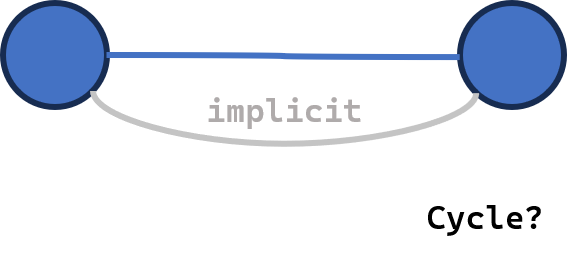
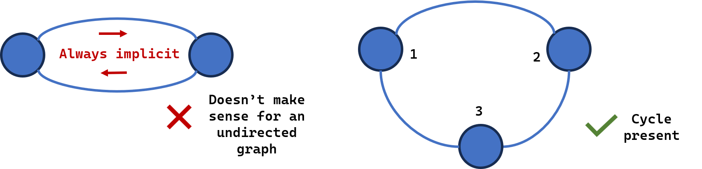

Now that we have an idea of directed and undirected graphs, we can explore a fundamental concept: "does this graph have a cycle?" Let's start with a simple undirected graph:

### Undirected Cycles

- **Undirected cycle:** a path that starts and ends at the same node. Is the following a cycle?



Its just a single edge. But It does fulfil our definition, you can start at A, go to B and come back to A. So we need to update our definition of a cycle.

A cycle is a path that starts and ends at the same node without reusing an edge, or length ≥ 3. So, if we start at A, without reusing the edge we just used we traverse the graph, and end up back at A, we have a cycle.



So to check if a graph has a cycle, we have to additionaly note down the edges we have already used while traversal.

Short exercise: Think about the steps to detect a cycle.

<!-- exercise window with simple graph with 4 nodes and 4 edges -->

::: {.static-graph-inline}
<div id="undirected-cycle-quiz"></div>
:::

```{ojs}
//| echo: false
import { mountCycleStepQuiz, UNDIRECTED_CYCLE_QUIZ_QUESTIONS } from "./js/cycle-helpers.js";

mountCycleStepQuiz(document.querySelector("#undirected-cycle-quiz"), {
  questions: UNDIRECTED_CYCLE_QUIZ_QUESTIONS,
})
```

Steps Summarised:
1. Start at the initial node as **current** node.
2. Mark the node as visited.
3. Get its neighbours. For each **neighbour**:
  1. Check if the neighbour is already visited.
  2. !! NEW STEP !! If it is already visited, we need to check if the edge current-neighbour is already used. If not, we have a cycle.
  3. If unvisited, push neighbour to bag. !! NEW STEP !! Note down the edges we used 
5. Pop the next node as current node and start again.

::: {.callout-hint}
Note: One thing to note is when we go to B, we will be checking the edge B-A outgoing from B, and we stored the edge A-B when we started from A. In undirected graphs they both mean the same, but we stored them as tuples so we need to be careful.

This method will work similarly for both BFS and DFS. Let's do a DFS implementation.

:::

Convert those steps into code. Drag the blocks into the loop body — initialisation is given. Press **Reveal solution** if you get stuck, then **Play** or **Next step** to watch the search on the same graph. At each node the current node and all of its neighbours light up together; visited nodes, visited edges, and the bag update underneath.

::: {.panel-grid}
::: {.panel}
<div id="find-cycle-blocks"></div>
:::
::: {.panel}
<div id="find-cycle-viz" class="cb-viz-placeholder"></div>
:::
:::

```{ojs}
//| echo: false
import { mountCodeBlocksView } from "./js/qmd-specific-utils/code-blocks-view.js";
import {
  FIND_CYCLE_CODE_BLOCKS,
  FIND_CYCLE_CODE_OPTIONS,
  mountFindCycleCodeViz,
} from "./js/cycle-helpers.js";
```

```{ojs}
//| echo: false
findCycleBlocks = mountCodeBlocksView(
  document.querySelector("#find-cycle-blocks"),
  FIND_CYCLE_CODE_BLOCKS,
  FIND_CYCLE_CODE_OPTIONS
)
```

```{ojs}
//| echo: false
findCycleViz = mountFindCycleCodeViz(document.querySelector("#find-cycle-viz"), {
  width: 360,
  height: 320,
  stepDelayMs: 900,
  onStep: (frame) => {
    if (frame?.blockId) findCycleBlocks.highlight(frame.blockId);
    else findCycleBlocks.clearHighlight();
  },
  onRevealSolution: () => findCycleBlocks.applySolution(),
})
```

### Directed Cycles 

- **Directed cycle:** a path that starts and ends at the same node. This removes the constraint of length ≥ 3, because in directed graphs, going back using the same edge DOES mean a cycle. BUT, visiting the same node twice through two different paths is not necessarily a cycle. 

How would we manually do it? We can select a node and start traversing. Note: We wont necessarily visit every node : only edges which are outgoing from start node. So we need to have multiple starting nodes.

Method: DFS. We will commit to a single traversal and go until we reach a node with no outgoing edges.
In this strategy will have an "active" path. During this path if we reach another "active" node we have a cycle. Once we reach the end of the path, we will turn the active path off and pick a different path.

Walk through the 3-colour DFS on a small directed graph. White means incomplete, blue means active (on the recursion stack), black means complete. Use **Next** and **Previous** to watch the stack grow and shrink.

::: {.static-graph-inline}
<div id="directed-cycle-walkthrough"></div>
:::

```{ojs}
//| echo: false
import { mountDirectedCycleWalkthrough } from "./js/cycle-helpers.js";

mountDirectedCycleWalkthrough(document.querySelector("#directed-cycle-walkthrough"), {
  width: 360,
  height: 280,
})
```

Lets simulate it. You can use a piece of paper or the following sandbox. Start at a random node, click on white nodes to turn them blue to indicate "active". Follow an active path till the end like a DFS. Then you can backtrack and turn the blue nodes black to indicate "complete". Try it yourself to figure out the algorithm.

::: {.panel}
<div id="directed-cycle-sandbox"></div>
:::

```{ojs}
//| echo: false
import { mountDirectedCycleSandbox } from "./js/cycle-helpers.js";

mountDirectedCycleSandbox(document.querySelector("#directed-cycle-sandbox"), {
  width: 640,
  height: 400,
})
```

::: {.callout-hint}

We will use DFS and recursion to implement this. The key here is we can only "complete" when we reach the END. So the "completion" effect will be propagated backwards in the graph, and a recursive function will make this much easier as we dont need to explicitly track the paths.

Final algorithm:
Initialisation: Mark all nodes as white "incomplete". Our aim is to "complete" all nodes and turn them black.

Starting from an "incomplete" white node:
1. Mark the node as blue or "active". 
3. Get its neighbours. For each **neighbour**:
  1. Check if the neighbour is already blue. If it is it means we found a cycle.
  2. If the neighbour is white, start another DFS traversal from this neighbour. If this DFS finds a cycle, return it.
4. If we have no neighbours or all neighbours are black, mark the node as black.

Do this for each incomplete node. At any point if we find a cycle, we return it.

:::

Convert those steps into code. Drag the blocks into the **dfs** body — the colour setup is given. Press **Reveal solution** if you get stuck, then **Play** or **Next step** to watch the 3-colour search on the same graph.

::: {.panel-grid}
::: {.panel}
<div id="directed-cycle-blocks"></div>
:::
::: {.panel}
<div id="directed-cycle-code-viz" class="cb-viz-placeholder"></div>
:::
:::

```{ojs}
//| echo: false
import {
  DIRECTED_CYCLE_CODE_BLOCKS,
  DIRECTED_CYCLE_CODE_OPTIONS,
  mountDirectedCycleCodeViz,
} from "./js/cycle-helpers.js";
```

```{ojs}
//| echo: false
directedCycleBlocks = mountCodeBlocksView(
  document.querySelector("#directed-cycle-blocks"),
  DIRECTED_CYCLE_CODE_BLOCKS,
  DIRECTED_CYCLE_CODE_OPTIONS
)
```

```{ojs}
//| echo: false
directedCycleViz = mountDirectedCycleCodeViz(document.querySelector("#directed-cycle-code-viz"), {
  width: 360,
  height: 280,
  stepDelayMs: 900,
  onStep: (frame) => {
    if (frame?.blockId) directedCycleBlocks.highlight(frame.blockId);
    else directedCycleBlocks.clearHighlight();
  },
  onRevealSolution: () => directedCycleBlocks.applySolution(),
})
```


Exercise: Around the world in 80 days (or is it?)
You are given a graph where each node is a country and each edge is a one-way flight. Check if there's a chance to get stuck in a cycle. If it is, return a set of nodes which should be reversed to break the cycle.

<!-- code editor -->

```{python}
G = {
  'USA': ['Canada', 'Brazil'],
  'Canada': ['UK', 'South Africa'],
  'South Africa': ['India'],
  'UK': ['Russia'],
  'China': ['Russia','Australia'],
}

def around_the_world(G):
    return
```
