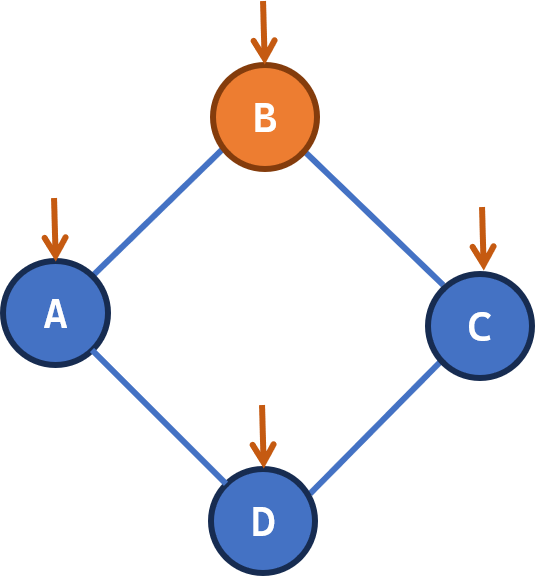
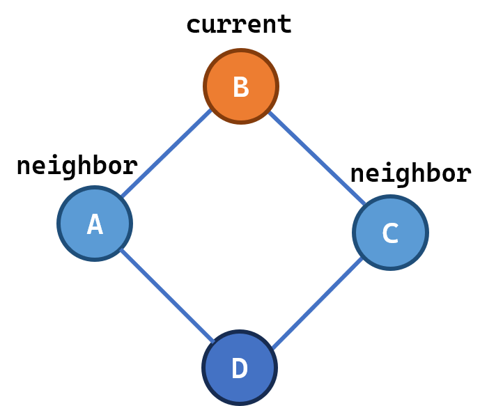
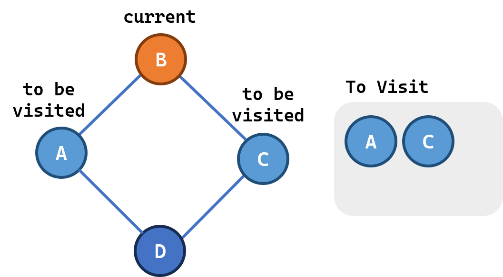
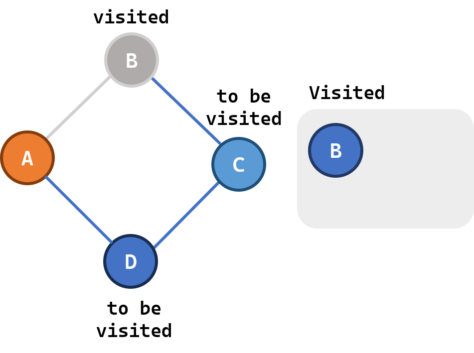
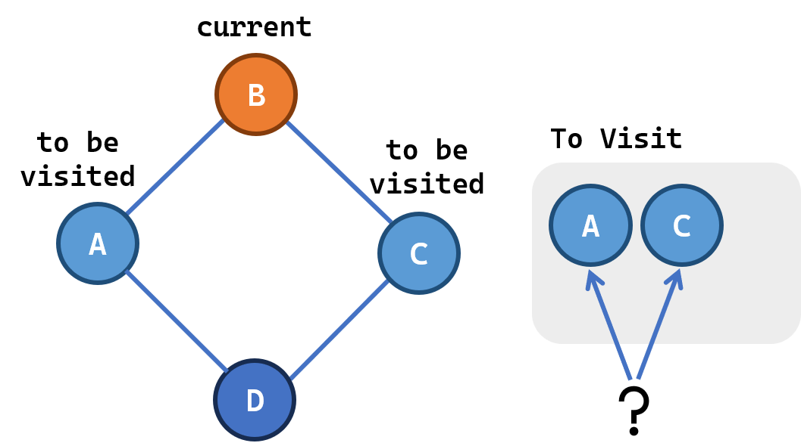

Now that we have a graph and a way to represent it, we can start to move through it. When we are doing so, we will create a "Path". Let's take an example of a path from node A to node E. 

## Walking Through a Traversal

Lets do a sample traversal!

::: {.static-graph-inline}
<div id="traversal-walkthrough"></div>
:::

```{ojs}
//| echo: false
//| output: false
import { mountStaticWalkthrough } from "./js/utils/static-walkthrough.js";

mountStaticWalkthrough(document.querySelector("#traversal-walkthrough"), {
  width: 360,
  height: 260,
  directed: false,
  graph: {
    nodes: [
      { id: "A", label: "A" },
      { id: "B", label: "B" },
      { id: "C", label: "C" },
      { id: "D", label: "D" },
      { id: "F", label: "F" },
      { id: "E", label: "E" },
    ],
    edges: [
      { id: "A—B", source: "A", target: "B" },
      { id: "A—C", source: "A", target: "C" },
      { id: "B—D", source: "B", target: "D" },
      { id: "C—D", source: "C", target: "D" },
      { id: "D—F", source: "D", target: "F" },
      { id: "F—E", source: "F", target: "E" },
    ],
  },
  steps: [
    {
      title: "Start Node",
      description: "We begin the traversal by picking a start node.",
      node: "A",
      nodeLabel: "Start node",
      highlight: { current: "A" }
    },
    {
      title: "Begin Traversal",
      description: "The current node is A. Its neighbours, B and C, are the possible next states we could move to. For the current traversal let us RANDOMLY choose to move to B.",
      node: "A",
      possibleNext: ["B", "C"],
      highlight: { current: "A", neighbours: ["B", "C"] }
    },
    {
      title: "Move to a Neighbour",
      description: "We move from A to its neighbour B, which becomes the new current node. We used the edge A—B to do so. Congratulations! We took our first step! But wait, how do we know what path we're taking? We need to **track** our path. So we record both the nodes we visited and the edges we used. We can also track the nodes we **encountered** but didn't visit, like C. But for now, lets just focus on the nodes we visited and the edges we used.",
      node: "B",
      from: "A",
      possibleNext: ["C"],
      visited: ["A", "B"],
      highlight: { current: "B", previous: "A", visited: ["A", "B"], pathEdges: ["A—B"] }
    },
    {
      title: "Next step",
      description: "From B we have 2 neighbours: D or the previous node A. Since we already visited A (we have also recorded this) we add D to the list of unvisited nodes. We still have C unvisited, but let's choose D as our next node.",
      node: "B",
      from: "A",
      visited: ["A", "B"],
      possibleNext: ["C","D"],
      highlight: { current: "B", previous: "A", neighbours: ["D"], visited: ["A", "B"], pathEdges: ["A—B", "B—D"] }
    },
    {
      title: "Continue Traversing",
      description: "We take another step, moving to D. Now we can see two new neighbours: C again and F. We can choose to move to F or C. Let's choose F.",
      node: "D",
      possibleNext: ["C","F"],
      visited: ["A", "B", "D"],
      highlight: { current: "D", previous: "B", neighbours: ["F","C"], visited: ["A", "B", "D"], pathEdges: ["A—B", "B—D"] }
    },
    {
      title: "Keep Going",
      description: "One more step takes us to F. From F we see the new node E and add it to the list of unvisited nodes. Now we move to E.",
      node: "F",
      possibleNext: ["C","E"],
      visited: ["A", "B", "D", "F"],
      highlight: { current: "F", previous: "D", neighbours: ["E"], visited: ["A", "B", "D", "F"], pathEdges: ["A—B", "B—D", "D—F"] }
    },
    {
      title: "Reach the End Node",
      description: "We arrive at E, the end node. We still have C unvisited, but we have reached the end node. So we stop the traversal.",
      node: "E",
      nodeLabel: "End node",
      possibleNext: ["C"],
      visited: ["A", "B", "D", "F", "E"],
      highlight: { end: "E", previous: "F", visited: ["A", "B", "D", "F", "E"], pathEdges: ["A—B", "B—D", "D—F", "F—E"] }
    },
  ],
})
```

Now in the above traversal:

1. We made 2 random choices which coincidentally led us to the end node. In real graphs, we do not know how the full graph looks like unless we fully explore the graph. So we need to have system to **Select the Next Node**.
2. While we visited B from A, we left out C. After we left A, we lost the knowledge of C's existence. We need to have system to **Record All Unvisited Nodes** so we can visit them later.
3. And we already noted that we need to record all the nodes we **Did Visit**.

::: {.ig-note label="Terminology Summary" collapse="true"}

#### 1. State

A state is the node we can be in at any given time.



#### 2. Neighbours

To define neighbours, we have to be at a single state. The other "states" we can visit from the current state are called neighbours.



#### 3. Tracking: Nodes we need to visit

Previously we simply tracked the path we were taking when we moved to B from A. We missed exploring C even though we encountered it. So we need a system to actually select next states and keep track of nodes we could have visited. 

The simplest, we can have a "bag" from which we select the next state we will visit. The bag will also help us keep track of nodes we could have visited but didn't.



#### 4. Tracking: Nodes we have visited

This is simply the list of nodes we have visited and the edges we have used. 



#### 5. Picking the Next Node

Once we have a list of unvisited nodes, we need to pick one to visit next. We can do this randomly or based on an algorithm.



:::

::: {.ig-qa}
### Exercise 1: Heat Spread

You're part of the crew on a large space station. While reading a book in your room, **P**, you start to feel cold, so you go to the **Cafeteria** to turn on the heater. However, you would rather continue reading in the comfort of your own room.

You realize that if the Cafeteria is connected to your room through the station's ventilation system, the warm air will eventually reach your room and you can return. Determine whether the heat can reach room P — or in other words, is there **a** path from the Cafeteria to room P?

:::

<div id="heat-quiz"></div>

```{ojs}
//| echo: false
import {
  mountHeatQuiz,
  mountHeatPlayground,
} from "./js/graph-traversal-helpers.js";

heat_quiz_questions = [
  {
    id: 1,
    question: {
      prompt: 'What are the "states" in this problem?',
      visibility: 3,
    },
    answer: {
      text: "The rooms in the space station.",
      visibility: 3,
      highlight: { start: "C", end: "P", visited: ["C", "M", "CQ","A","G","S", "AD", "P"], },
      tracking: [],
      note: "States = rooms the heat (or you) can be in.",
    },
  },
  {
    id: 2,
    question: {
      prompt:
        'How do we track the rooms we NEED TO VISIT?',
      visibility: 3,
      bag: [],
    },
    answer: {
      text: "We will keep tracking rooms as we encounter them. At first, we only know of the existence of the Cafeteria so we will track it.",
      visibility: 3,
      highlight: {
        start: "C",
        end: "P",
        current: "C",
      },
      bag: ["C"],
      tracking: [],
      trackPick: ["C"],
    },
  },
  {
    id: 3,
    question: {
      prompt: "For our traversal, what is the start state?",
      visibility: 3,
      bag: ["C"],
    },
    answer: {
      text: "We now start our traversal. We look at the list of unvisited nodes and pick one. In this case, we only have Cafeteria which is also our start node.",
      visibility: 3,
      highlight: { start: "C", end: "P", current: "C" },
      bag: ["C"],
      bagPick: "C",
      tracking: [],
      note: "Heat starts spreading from the Cafeteria.",
    },
  },
    {
    id: 4,
    question: {
      prompt:
        "Now we \"pick\" Cafeteria, we know that heat can reach here. What to track in this case?",
      visibility: 3,
      highlight: {
        current: "C",
      },
      bag: ["C"],
      bagPick: "C",
    },
    answer: {
      text: "Since we are starting at the Cafeteria, heat can reach here. We track it.",
      visibility: 3,
      tracking: ["C"],
      highlight: {
        current: "C",
      },
      bag: ["C"],
      bagPick: "C",
      note: "We can also choose to track these when we put them IN the bag.",
    },
  },
  {
    id: 5,
    question: {
      prompt:
        "Now that we have fully visited Cafeteria, what are the next rooms we need to note down for future exploration?",
      visibility: 1,
      tracking: ["C"],
      highlight: {
        current: "C",
      },
      bag: ["C"],
      bagPick: "C",
    },
    answer: {
      text: "MedBay and Crew Quarters are the neighbours, so we will track them in the bag. We also remove the Cafeteria from the bag because we have already explored it.",
      visibility: 1, 
      highlight: {
        neighbours: ["M", "CQ"],
      },
      bag: ["M", "CQ"],
      tracking: ["C"],
      trackPick: ["C"],
      },
  },
  {
    id: 6,
    question: {
      prompt:
        "How do we pick the next room to continue the traversal?",
      visibility: 1,
      bag: ["M", "CQ"],
      tracking: ["C"],
    },
    answer: {
      text: "We randomly pick one room from the bag. We also track it as \"heat reachable\".",
      visibility: 1,
      highlight: {
        end: "P",
        current: "M",
      },
      bag: ["M", "CQ"],
      bagPick: "M",
      tracking: ["C", "M"],
      note: "Random pick from the bag = unordered traversal.",
    },
  },
  {
    id: 7,
    question: {
      prompt: "What do bag as we move to the MedBay?",
      visibility: 4,
      bag: ["M","CQ"],
      bagPick: "M",
      tracking: ["C","M"],
      highlight: {
        current: "M",
      },
    },
    answer: {
      text: "We bag MedBay's neighbours as we need to traverse them. \n\n We notice that Cafeteria has already been tracked so we do not add it to the bag again.",
      visibility: 4,
      highlight: {
        current: "M",
        previous: "C",
        neighbours: ["A"],
      },
      bag: ["M","CQ", "A"],
      bagPickDone: "M",
      tracking: ["C","M"],
      note: "Tracking = all reachable rooms / Bag = rooms we have to visit in the future",
    },
  },
  {
    id: 8,
    question: {
      prompt: "When do we stop the traversal?",
      visibility: 4,
      bag: ["CQ", "A"],
      bagPick: "A",
      tracking: ["C","M","A"],
      highlight: {
        current: "A",
      }
    },
    answer: {
      text: "When we reach room P OR we run out of rooms in the bag",
      visibility: 2,
      highlight: {
        start: "C",
        end: "P",
        current: "P",
        visited: ["C", "M", "A", "P"],
      },
      bag: ["CQ"],
      tracking: ["C", "M", "A", "P"],
      note: "Goal reached: stop as soon as P is encountered. We can abandon the remaining unvisited nodes for this particular application.",
    },
  },
];

heatQuiz = mountHeatQuiz(document.querySelector("#heat-quiz"), {
  width: 400,
  height: 260,
  questions: heat_quiz_questions,
})
```

Convert it to code!

::: {.ig-tip}
<details>
<summary>Hint</summary>
The flow is:

1. initialisation: track and bag the first node: cafeteria
2. traversal: pick a random node from the bag, add its neighbours to tracking and remove it from the bag
3. continue to pick nodes from the bag until it is empty OR you encounter the goal node
</details>
:::

::: {.panel-grid}
::: {.panel}
<div id="heat-code-blocks"></div>
:::
::: {.panel}
<div id="heat-code-viz" class="cb-viz-placeholder"></div>
:::
:::

```{ojs}
//| echo: false
import { mountCodeBlocksView } from "./js/qmd-specific-utils/code-blocks-view.js";
import { mountHeatCodeViz } from "./js/graph-traversal-helpers.js";
```

```{ojs}
//| echo: false
heatCodeBlocks = mountCodeBlocksView(document.querySelector("#heat-code-blocks"), [
  { id: "pick", code: "node = random.choice(list(bag))", label: "pick a random node from the bag" },
  { id: "check_goal", code: "if node == \"P\":\n    heat_reachable = True\n    break", label: "check if we reached the goal — stop if so" },
  { id: "track_neighbours", code: "neighbours = get_neighbours(node)\ntracking.add(neighbours)", label: "track the current node's neighbours" },
  { id: "bag_neighbours", code: "bag.add(neighbours)", label: "add the neighbours to the bag" },
  { id: "remove_node", code: "bag.remove(node)", label: "remove the current node from the bag" },
], {
  heading: "Traversal Steps",
  workspaceLabel: "Loop body — while bag:",
  preplaced: [],
  solutionOrder: ["pick", "check_goal", "track_neighbours", "bag_neighbours", "remove_node"],
  lockedBefore: [
    { code: "bag = set()\ntracking = set()\n\ntracking.add(\"Cafeteria\")\nbag.add(\"Cafeteria\")\nheat_reachable = False" },
  ],
  lockedContainer: { code: "while bag:" },
})
```

```{ojs}
//| echo: false
heatCodeViz = mountHeatCodeViz(document.querySelector("#heat-code-viz"), {
  width: 420,
  height: 280,
  stepDelayMs: 900,
  getPython: () => heatCodeBlocks.toPython(),
  onStep: (frame) => {
    if (frame?.blockId) heatCodeBlocks.highlight(frame.blockId);
    else heatCodeBlocks.clearHighlight();
  },
})
```

::: {.ig-tip}
In the above code, for simplicity, we are not checking if P exists in the neighbours. Thus we are depending on the random choice to pick P from the bag to stop the loop. We can simply add that condition if we wish to make it faster.
:::

::: {.ig-qa}

### Exercise 2: Danger Rooms

**Q.** Oh no! There is a breach in the admin room window and all air is leaking out. The space station is on lockdown. All rooms connected to the admin room vents are dangerous. Can you list out all these rooms?

You will be getting the adjacency list of the graph "G" as input.

::: {.ig-tip label="Hint" collapse="true"}

You can start traversing from the admin room. This time the stop condition is when the bag is empty.

:::

Note - Use the variable <span class="ig-code">danger_rooms</span> to track the rooms that are dangerous. This list will be visualised on the right.

:::

::: {.panel-grid}
::: {.panel}
<div id="danger-editor"></div>
:::
::: {.panel}
<div id="danger-viz" class="cb-viz-placeholder"></div>
:::
:::

```{ojs}
//| echo: false
import { PythonEditorInput } from "./js/qmd-specific-utils/python-editor-input.js";
import {
  createStationGraphData,
  dangerRoomsStarterCode,
  dangerRoomsSolutionCode,
  mountDangerRoomsViz,
} from "./js/graph-traversal-helpers.js";
```

```{ojs}
//| echo: false
dangerStation = createStationGraphData({ width: 420, height: 280 })
```

```{ojs}
//| echo: false
dangerEditor = PythonEditorInput.mountPlayable(
  document.querySelector("#danger-editor"),
  {
    heading: "Python",
    defaultCode: dangerRoomsStarterCode(dangerStation),
    solutionCode: dangerRoomsSolutionCode(dangerStation),
  }
)
```

```{ojs}
//| echo: false
dangerViz = mountDangerRoomsViz(document.querySelector("#danger-viz"), {
  width: 420,
  height: 280,
  editor: dangerEditor,
  data: dangerStation,
})
```


